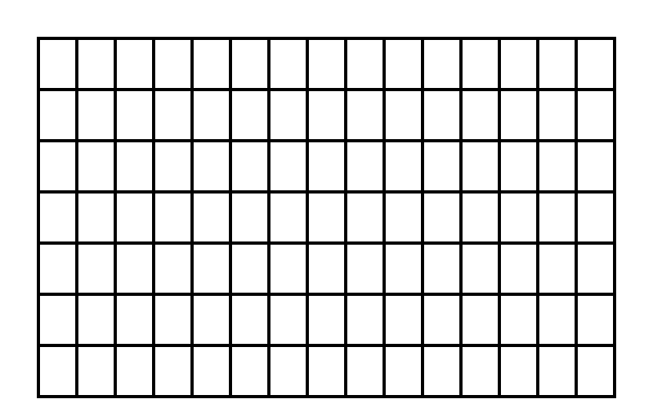
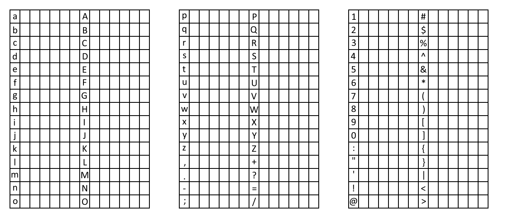
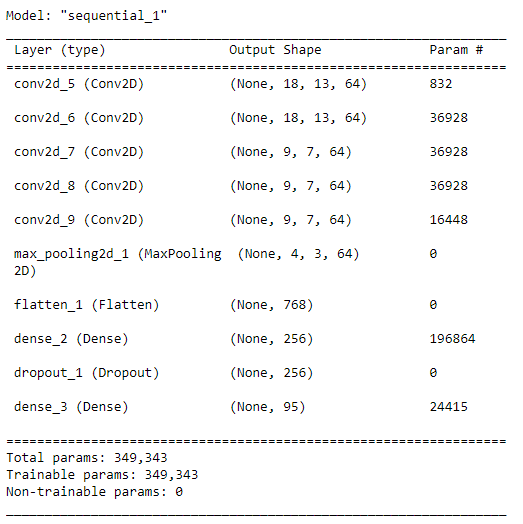
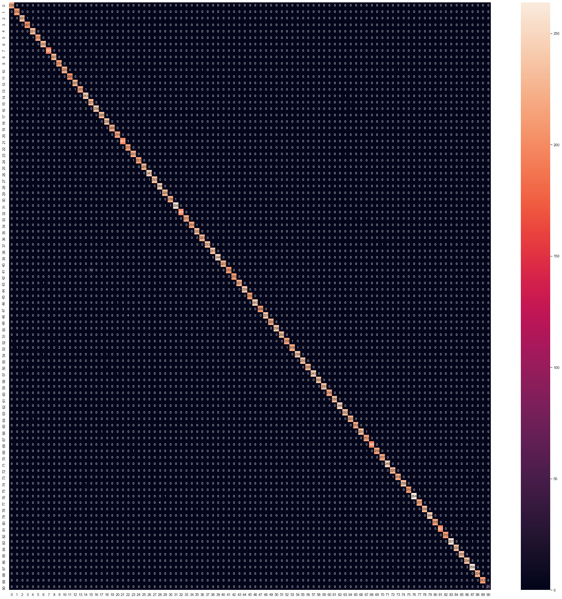
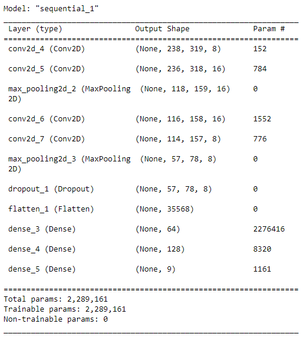
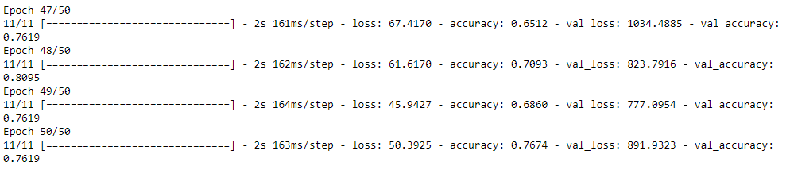

<h1 style="text-align:center">ChickenScratch</h1>

<h2>About</h2>
ChickenScratch is a machine learning text-recognition project. The project allows users to take photos of text using the Portenta H7 microcontroller, have that text parsed and finally sent to a desktop application where a user can copy the text into the word processing program of their choosing.

<h2>Team</h2>
Teegan Krieger - Character Recognition, Desktop Application, and Data Preprocessing  
Eric Yan - Portenta Application and Data Collection  
Tom Truong - Grid Recognition and Data Collection

<h2>Components</h2>
<ul>
    <li>
        <a href="#data">Data Collection</a> - This is the process of collecting and processing data.
    </li>
    <li>
        <a href="#portenta">Portenta App</a> - This is the code that is loaded onto the Portenta microcontroller.
    </li>
    <li>
        <a href="#character">Character Recognition Model</a> - This is a Machine Learning model that is trained to classify 95 different characters.
    </li>
    <li>
        <a href="#grid">Grid Recognition Model</a> - This is a Machine Learning model that is trained to find the corners of grid images.
    </li>
    <li>
        <a href="#desktop">Desktop App</a> - This is an application designed to recieve messages from the Portenta app and allow the user to copy text to their clipboard.
    </li>
</ul>

<h2>Limitations</h2>
<ul>
    <li>
        Text must be written into a predefined grid
    </li>
    <li>
        Text must be written with a sharpie or otherwise written such that the text is thick
    </li>
</ul>

<h2 id='data'>Data Collection and Pre-Processing</h2>
To collect data for this project, we opted to create sheets of paper that we handed out to our classmates for them to fill in. These sheets contained cells to write every character we wished to classify.

Once these sheets were filled out, we opted to scan these in using a printer scanner (You will see later that this proved to be a fatal error). We then sliced each of these grids into individual cells, resized each of these individual cells, adjusted their brightness at random and saved them. 

Originally, we had 113 samples per character. After applying the brightness randomization augmentation, this number jumped to 1130 samples per character. This meant we went from a total of 10,735 samples to a hefty 107,350 samples. Having this extra data allows our Character Recognition Model to push past 70% validation accuracy!

<h2 id='portenta'>Portenta Application</h2>

The Portenta Application performs the following steps to be able to recognize text:

* First a picture is taken with the Portenta camera. This picture is then passed into the grid recognition model.

* The grid recognition model takes a picture as an input and attempts to recognize the 4 corners of a grid within the picture. It should also be able to detect if no grid is present.

* The image is then sliced into smaller images using an algorithm that is informed by the corners of the grid. These smaller images are then passed into the character recognition model.

* The character recognition model will take a cropped image of a single character as an input and attempt to classify which character it is looking at.

* The results of each character recognition iteration are concatenated into a string which is then sent to our desktop application.

<h2 id='character'>Character Recognition Model</h2>

The Character Recognition Model is designed to classify 95 different characters. Those being the letters a-z, A-Z, 0-9 and most special characters on a standard keyboard.

This model takes an image of a single character as an input and returns a number representing the class with the highest probability of being the correct class.

The Character Recognition Model is defined as follows:

This model, when trained on our dataset, had a roughly 99% validation accuracy.

<h2 id='grid'>Grid Recognition Model</h2>

The Grid Recognition Model is designed to find the four corners of one of our grids. 

This model takes an image of a grid (or lack thereof) as an input and returns a 9-tuple defined as follows (isValidGrid(0 or 1), x1(pixel coordinate), y1, x2, y2, x3, y3, x4, y4).

The Grid Recognition Model is defined as follows:

This model, when trained on our dataset, had a roughly 76% validation accuracy.

<h2 id='desktop'>Desktop Application</h2>

The Desktop Application will create a window and a system tray icon. The window will display a list of buttons for each string it recieves from the Portenta. The user can click these buttons to copy the text to the clipboard. The System Tray icon allows a user to select the serial port to use as well as allowing for the window to be closed but the application to persist while not in use.

<h2>Improvements that could be made</h2>

Unfortanately this project does not work in a practical sense at the moment. During data collection (for the character recognition model), we opted to scan data in using a printer scanner and make augmentations to the data to try and make it similar to how images may look when taken with the Portenta. This was a bad idea!!! Our model became overfitted to our training data which was too out of line with the Portenta camera, resulting in it being incapable of classifying real images.

If this project were to continue, we would opt to rescan all of our data using the Portenta camera. This would almost certainly fix the issues we faced.